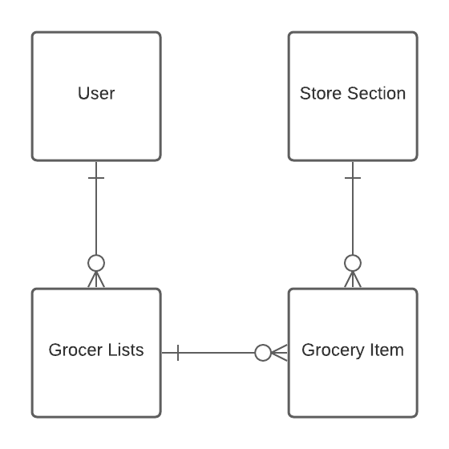
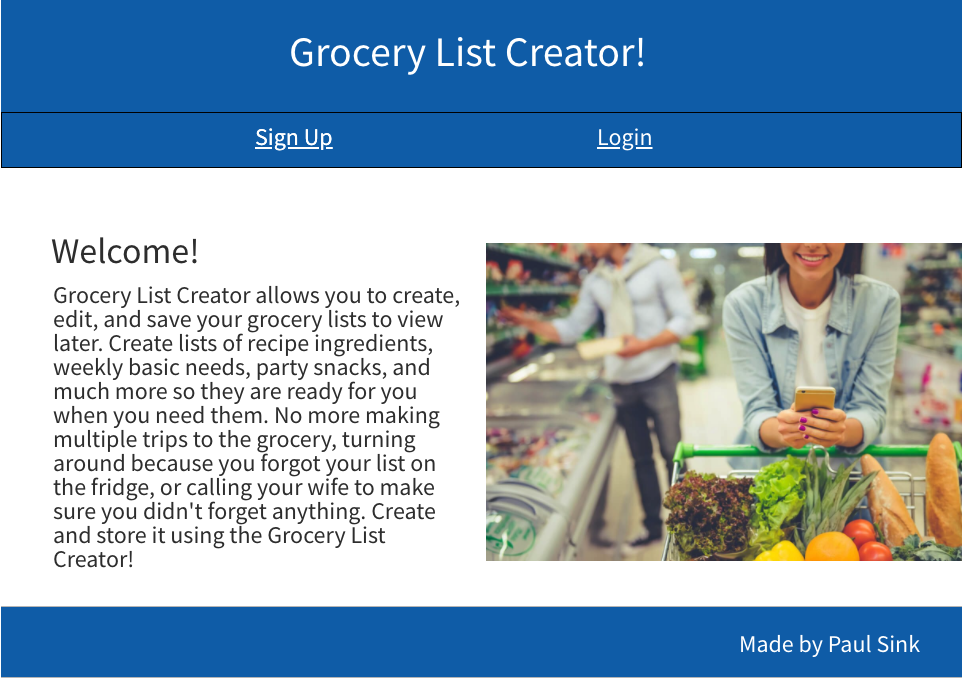
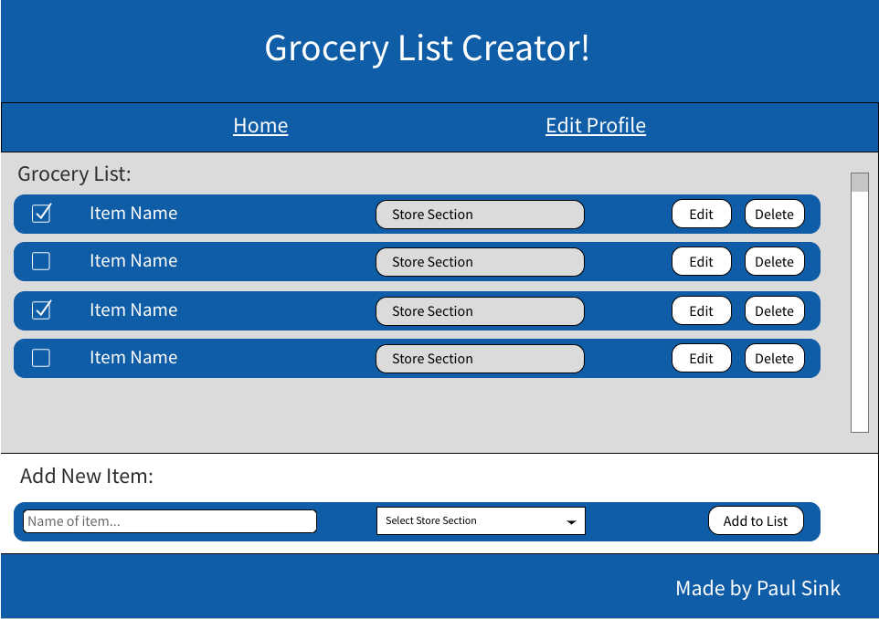

# Grocery List Creator 

## Description  

This application allows users to create and save a grocery list online. Each user can add a new item including what section of the grocery store they can find it in.

## Project Links

* [Github Repo](https://sink-project2-grocerylist-app.herokuapp.com/)
* [Deployment](https://github.com/PaulDSink/grocery_list)

## Approach  

My approach for this project was to meet my minimum viable product(MVP) that included full CRUD functionality allowing a user to sign in and view, add and delete items from their grocery list.
  

### MVP  

#### 7 Restful Roots
| **URL** | **HTTP Verb** |  **Action**|
|------------|-------------|------------|
| /        | GET       | index  
| /auth/signup         | GET       | new   
| /auth/signup          | POST      | create   
| /users/profile/:id      | GET       | show       
| /users/profile/:id/edit | GET       | edit       
| /users/profile/:id/edit      | PATCH/PUT | update    
| /users/profile/:id/edit     | DELETE    | destroy 

### Post MVP  

After reaching MVP, I would like to add functionality that allows users to have multiple different grocery lists. I also want to add the ability for users to share thier grocery lists with one another. Additionally, I would like to do more work on the styling to make the list view look like it is on a grocery list or piece of paper.

### Unsolved Problems  

 While updating a user's profile, that user sees the encrypted password and not their raw password. I need to fix that feature so the user sees their password, can update it, and it is encrypted again.

### Entity Relationship Diagram

Above is my entity relationship diagram (ERD) of my grocery list app. It shows the relationships between the tables of my application.

### Wireframe  

  
The above picture is the initial wireframe for the home page of my application.

The above picture is the initial wireframe for the list view of my application.

## Example  

Above is an example of the functionality of my application.

### User Stories  

* As Steve, I want to log into my profile so only I can view my list.
* As Jenny, I want to view my grocery list from my phone so I do not need to remember to bring a list to the store.
* As Dennis, I want to add items to my list when I think of them so I don't forget something while shopping.
* As Mark, I want to delete items from my list so I do not get them again the next time I am at the store.
* As Kim, I want to update my name on my profile.
* As Henry, I want to delete my account since I no longer use the application.
* As a fast shopper, I want to be able to view what area of the store each of my items are in so I don't miss an item while I am in that part of the store.
* As John, I want to create multiple groceries for different meals I plan on having so I know what to get at the store when cooking certain dishes.
* As Tonya, I want to share my list with my husband so he doesn't forget anything.
* As George, I want to be able to check off items as I put them in my cart without deleting them so I know what I have already grabbed.

## Features  

I used the following technologies on this project:

* HTML5
* CSS3
* JavaScript
* Node.js
* Express Framework
* PostgreSQL

## Installation  

This application has been deployed and can be accessed to play by visiting https://sink-project2-grocerylist-app.herokuapp.com/ with any web browser.  

## Contribution  

Source code: [click here](https://github.com/PaulDSink/grocery_list)  
Issue reporting: [click here](https://github.com/PaulDSink/grocery_list/issues)